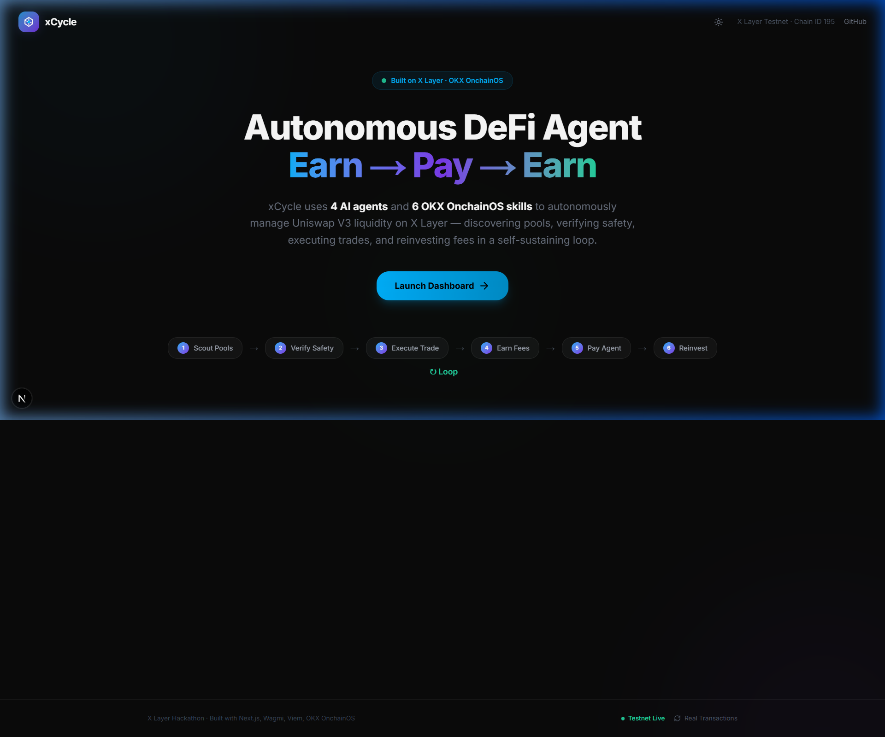
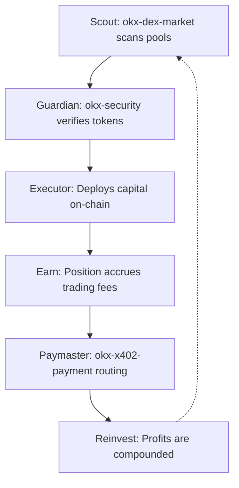

<div align="center">
  
  <h1>xCycle</h1>
  <p><strong>Autonomous Uniswap V3 Liquidity Agent on X Layer</strong></p>
  <p>
    An intelligent, self-sustaining DeFi agent powered by the OKX OnchainOS stack to automatically discover, verify, and manage on-chain liquidity positions.
  </p>
</div>

<br/>

## 🌟 Overview

**xCycle** is a fully functional, production-ready web application that integrates OKX OnchainOS skills to autonomously identify optimal Uniswap V3 liquidity positions, manage impermanent loss risk, and execute a continuous, self-sustaining **earn → pay → earn** loop.

The application features a premium dark/light mode dashboard designed with Framer Motion, presenting real-time on-chain data in a highly visual and immersive way.

<br/>

> 📸 *xCycle Landing Page*
<div align="center">
  
</div>

<br/>

## 🏗️ Architecture & Tech Stack

- **Framework**: Next.js 16 (App Router) with TypeScript
- **Styling**: Tailwind CSS v4 + Next-Themes (Light/Dark Mode)
- **UI & Animations**: Shadcn UI & Framer Motion
- **Web3 Integration**: Wagmi v3 + Viem + `@tanstack/react-query`
- **Agent Intelligence**: Real OKX DEX API calls via authenticated server proxy (`/api/okx`)
- **Network**: X Layer Testnet (Chain ID 195)

---

## 🤖 Multi-Agent System 

xCycle leverages your connected wallet as the core **Agentic Wallet**—the on-chain identity that programmatically executes trades and manages capital. The system uses four specialized agents working in sequence:

| Agent | Role | Active OnchainOS Skill |
|-------|------|-----------------|
| **Scout** | Discovers high-yield pools & fetches DEX quotes | `okx-dex-market`, `okx-dex-token` |
| **Guardian** | Live token risk scanning & contract verification | `okx-security`, `viem.getCode` |
| **Executor** | Broadcasts capital deployment transactions | `okx-onchain-gateway`, `wagmi` |
| **Paymaster** | Agent-to-agent OKB transfers for the x402 loop | `okx-x402-payment` |

---

## ⚙️ Core OnchainOS Capabilities

The platform operates utilizing **6 core OnchainOS skills** running on live data:

1. **`okx-agentic-wallet`**: Reads real on-chain balances (OKB, USDC, WOKB, USDT).
2. **`okx-dex-market`**: Interacts with the OKX DEX Aggregator API to fetch real-time swap quotes and discover active pools.
3. **`okx-security`**: Dual-layer security performing live on-chain contract checks combined with the OKX Token Risk API for honeypot/phishing detection.
4. **`okx-dex-swap`**: Builds precise, gas-optimized transaction calldata instantly from the OKX DEX API.
5. **`okx-onchain-gateway`**: Performs gas estimation, transaction simulation, and strict receipt tracking.
6. **`okx-x402-payment`**: Executes native OKB transfers to fuel self-sustaining multi-agent interactions.

### Uniswap V3 Integrations
- Fully parses LP positions from `NonfungiblePositionManager.positions()`.
- Calculates yield dynamics dynamically reading from contract balance parameters.
- Implements direct interaction ABIs for `decreaseLiquidity`, `mint`, and `collect`.

---

## 🔄 Working Mechanics

### The Self-Sustaining Loop



### Natural Language Execution
Users interact with the agents naturally through the integrated terminal:
- `"Check my balance"` → Initiates `okx-agentic-wallet` state readings.
- `"Show positions"` → Activates `okx-wallet-portfolio` via Uniswap V3.
- `"Start xCycle with 500 USDC"` → Executes the entire 5-step risk-checked protocol.

---

## 🌍 Network Configuration

### 📜 Contract Addresses (X Layer Testnet)

| Protocol Component | Address |
|--------------------|---------|
| **WOKB** | `0xe538905cf8410324e2A5a7866A4F6528Ff4438e1` |
| **USDC** | `0x8f5F1fac983A4Eb5c5e685f0B7c5aA4a29E4b6A3` |
| **USDT** | `0x1E4a5963aBFD975d8c9021ce480b42188849D41d` |
| **Uniswap V3 Router** | `0xE592427A0AEce92De3Edee1F18E0157C05861564` |
| **Uniswap V3 Factory** | `0x1F98431c8aD98523631AE4a59f267346ea31F984` |

---

## 🚀 Getting Started

### 1. Installation

```bash
git clone https://github.com/YOUR_USERNAME/xCycle.git
cd xCycle
npm install
```

### 2. Configuration Configuration 

```bash
cp .env.example .env
```
Inside `.env`, configure your OKX API credentials. (Create these at the [OKX Developer Portal](https://web3.okx.com/onchain-os/dev-portal)):
```env
OKX_API_KEY="your-api-key"
OKX_SECRET_KEY="your-secret-key"
OKX_PASSPHRASE="your-passphrase"
```
*(Note: xCycle will gracefully fallback to standard viem-RPC operations if keys are omitted)*.

### 3. Execution

```bash
npm run dev
```
Navigate to [http://localhost:3000](http://localhost:3000) to access the dashboard.

---


## 📄 License
This project is licensed under the MIT License.
